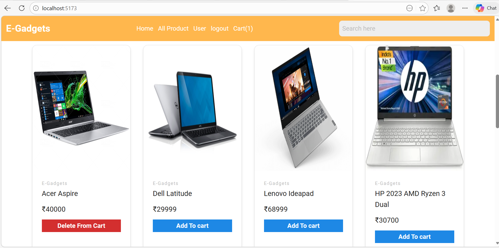

# E-Gadgets

**E-Gadgets** is a React + Vite based e-commerce frontend demo focused on selling gadgets and electronics. It includes user authentication, product browsing, cart management, and admin product management.

## 🚀 Features

- ✅ **Product browsing** with category filters
- ✅ **Cart management** with Redux
- ✅ **Authentication** (signup/login) via Firebase
- ✅ **Admin panels** for adding/updating products
- ✅ **Protected routes** (user vs admin)
- ✅ **Responsive UI** built with Tailwind CSS + Material Tailwind
- ✅ **Toast notifications** for user feedback

## 🧰 Tech Stack

- **React 18**
- **Vite** (fast dev server + build)
- **Firebase** (auth + database)
- **Redux Toolkit** (cart state management)
- **React Router v6** (routing)
- **Tailwind CSS** (styling)
- **Ant Design** + **Material Tailwind** (UI components)

## 📁 Project Structure (key folders)

- `src/components/` – reusable UI components
- `src/pages/` – page-level components (home, cart, admin, etc.)
- `src/context/` – React context for global state
- `src/redux/` – Redux slice + store
- `src/firebase/` – Firebase configuration
- `src/protectedRoute/` – route guards for user/admin

## 🔧 Setup & Run

The working project is located in the `E-gadget/` subfolder. Run the commands from there:

```bash
cd E-gadget

# 1) Install dependencies
npm install

# 2) Start dev server
npm run dev
```

Then open the local URL shown in the terminal (typically `http://localhost:5173`).

## 📝 Notes

- Update `src/firebase/FirebaseConfig.jsx` with your own Firebase project settings.
- Admin routes are protected; you'll need to set an admin flag in the user profile (or update the auth logic) to access the admin dashboard.


(E-gadget/images/online-shopping-cart-app-2.png)
(E-gadget/images/online-shopping-cart-app-3.png)
(E-gadget/images/online-shopping-cart-app-4.png)
(E-gadget/images/online-shopping-cart-app-5.png)
(E-gadget/images/online-shopping-cart-app-6.png)